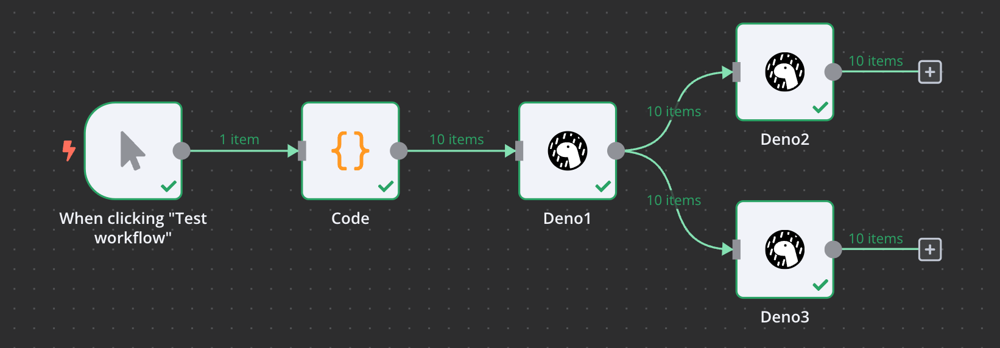
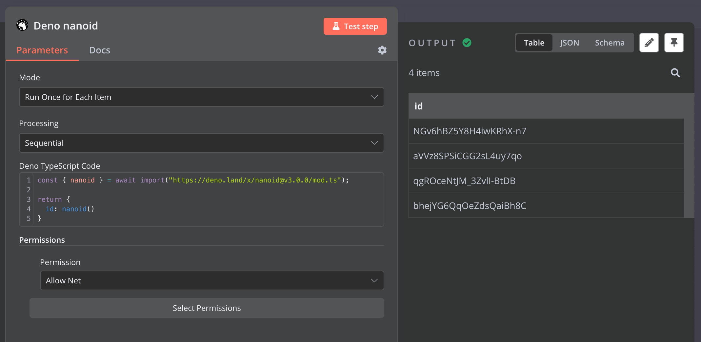
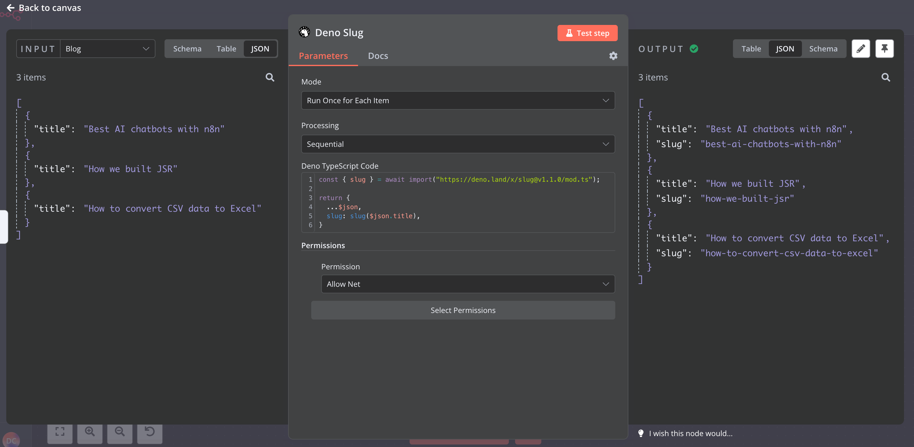
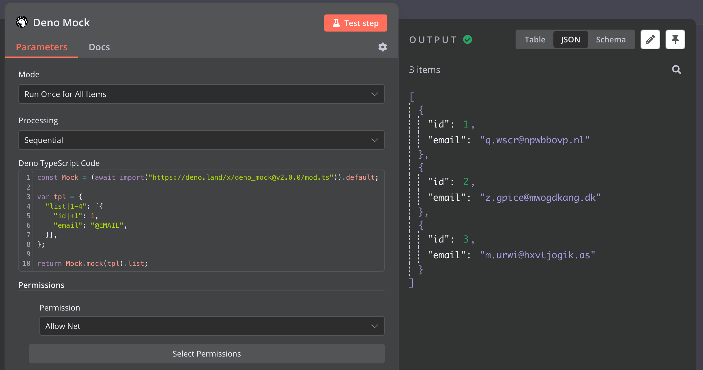

# n8n-nodes-deno-code



This is an n8n community node. It lets you use <a href="https://deno.com/">Deno</a> in your n8n workflows.

Deno is the open-source JavaScript runtime for the modern web. Built on web standards with zero-config TypeScript, unmatched security, and a complete built-in toolchain, Deno is the easiest, most productive way to JavaScript.

[n8n](https://n8n.io/) is a [fair-code licensed](https://docs.n8n.io/reference/license/) workflow automation platform.

[Installation](#installation)  
[Operations](#operations)   
[Compatibility](#compatibility)  
[Usage](#usage)  <!-- delete if not using this section -->  
[Resources](#resources)

## Installation

Follow the [installation guide](https://docs.n8n.io/integrations/community-nodes/installation/) in the n8n community nodes documentation.

## Operations

* Execute TypeScript code in Deno runtime
* Allows you to import any of thousands of Deno and npm libraries
* Support modes like in [Code node](https://docs.n8n.io/code/code-node/): "Run Once for All Items" or "Run Once for Each Item"
* Support Sequential or Parallel execution for input items
* Support Deno [Permissions](https://docs.deno.com/runtime/manual/basics/permissions)

## Compatibility

* Tested against n8n version: 1.37.3
* Tested against Deno version: 1.42.4

### Docker 

Deno code Node does not work in the original [n8nio/n8n - Docker Image](https://hub.docker.com/r/n8nio/n8n).

The libraries required for Deno need to be installed in the container. 

This can be done as follows: [Dockerfile](docker/n8n/Dockerfile). The source of the solution: [Deno Alpine Dockerfile](https://github.com/denoland/deno_docker/blob/4d61d7da8e7350ee31862d1a5e6268993f4dd1ff/alpine.dockerfile#L22).

```dockerfile
ARG N8N_VERSION

FROM gcr.io/distroless/cc as cc

FROM n8nio/n8n:${N8N_VERSION}

USER root

# from: https://github.com/denoland/deno_docker/blob/4d61d7da8e7350ee31862d1a5e6268993f4dd1ff/alpine.dockerfile#L22
COPY --from=cc --chown=root:root --chmod=755 /lib/*-linux-gnu/* /usr/local/lib/
COPY --from=cc --chown=root:root --chmod=755 /lib/ld-linux-* /lib/

RUN mkdir -p /lib64 \
    && ln -sf /usr/local/lib/ld-linux-* /lib64/ \
    && rm -f /usr/local/lib/libgcc_s.so.1

ENV LD_LIBRARY_PATH="/usr/local/lib"

USER node
```

## Usage

Generate id with [nanoid | Deno](https://deno.land/x/nanoid/mod.ts)

```typescript
const { nanoid } = await import("https://deno.land/x/nanoid@v3.0.0/mod.ts");

return {
  id: nanoid()
}
```


Slugify blog title with [slug | Deno](https://deno.land/x/slug/mod.ts)
```typescript
const { slug } = await import("https://deno.land/x/slug@v1.1.0/mod.ts");

return {
  ...$json,
  slug: slug($json.title),
}
```


Generate mock data with [deno_mock | Deno](https://deno.land/x/deno_mock/mod.ts)
```typescript
const Mock = (await import("https://deno.land/x/deno_mock@v2.0.0/mod.ts")).default;

var tpl = {
  "list|1-4": [{
    "id|+1": 1,
    "email": "@EMAIL",
  }],
};

return Mock.mock(tpl).list;
```


## Resources

* [n8n community nodes documentation](https://docs.n8n.io/integrations/community-nodes/)
* [Deno, the next-generation JavaScript runtime](https://deno.com/)
* [kt3k/deno-bin: Use Deno via npm](https://github.com/kt3k/deno-bin)
* [casual-simulation/node-deno-vm: A VM module for Node.js that utilizes the secure environment provided by Deno](https://github.com/casual-simulation/node-deno-vm)
